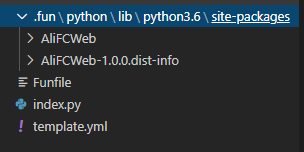
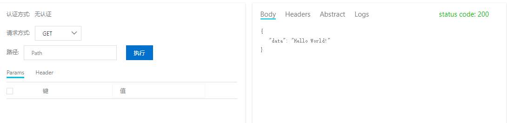
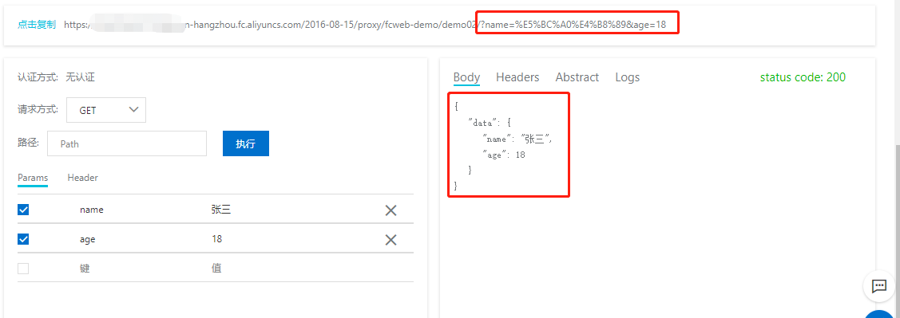
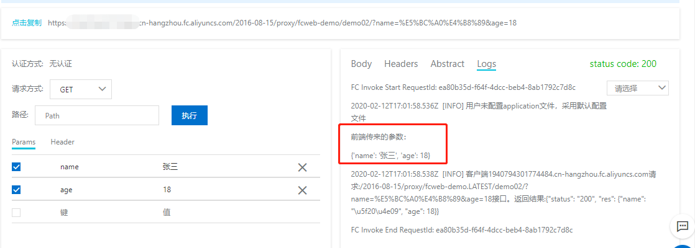
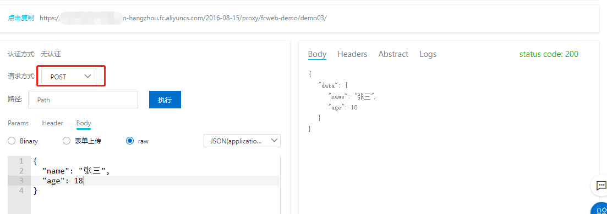
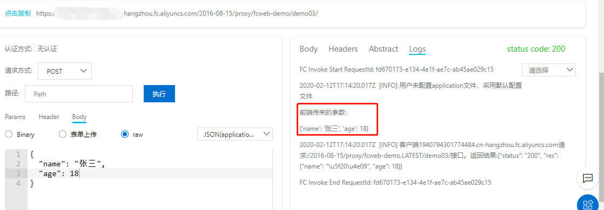
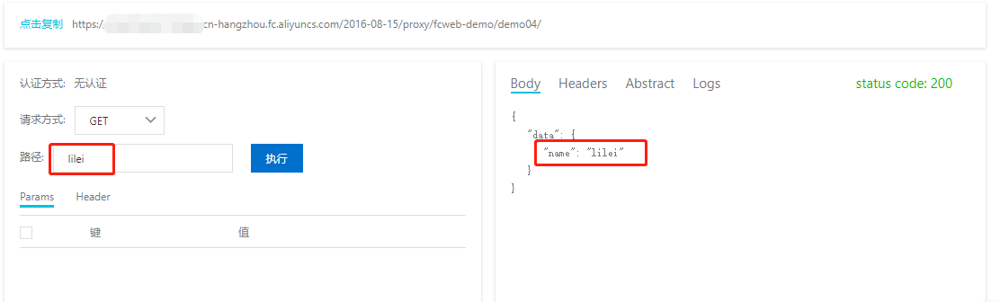
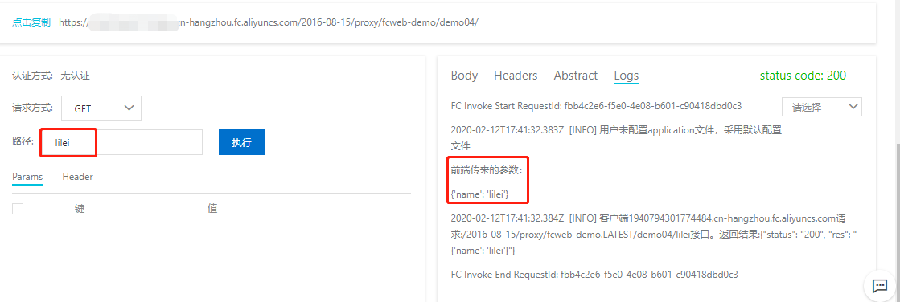
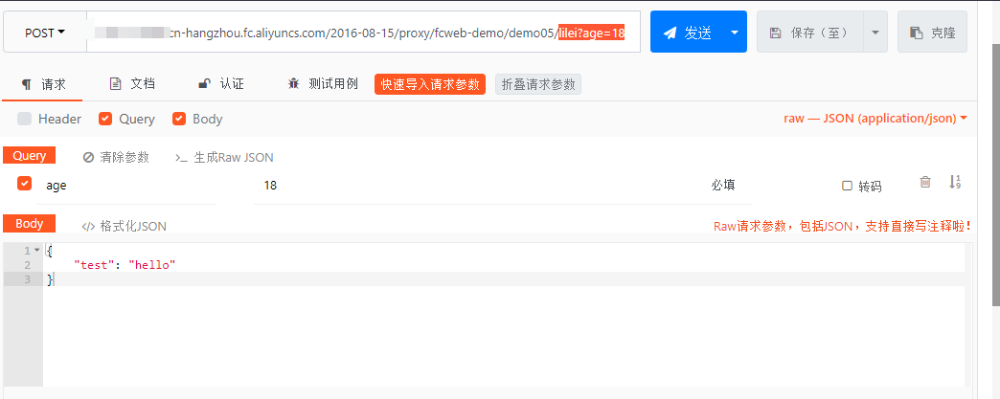
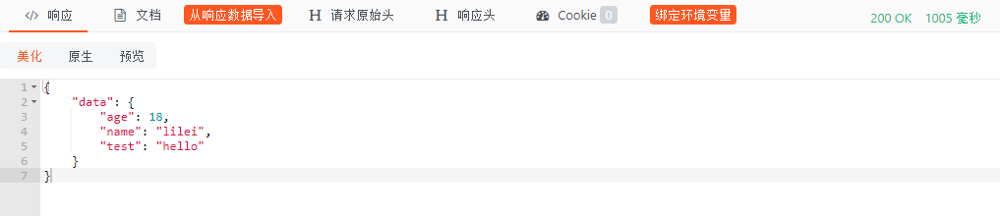

## 一、安装
``` shell
# 本地安装
pip install AliFCWeb
# fun安装
fun install --save --runtime python3 --package-type pip AliFCWeb
```

## 二、快速入门
### 本地配置fun
由于AliFCWeb是第三方库，所以需要自己上传，为了使用方便，我们使用阿里云官方调试工具fun进行代码编写和调试。
- 安装fun，安装教程参考[官方文档](https://github.com/alibaba/funcraft/blob/master/docs/usage/installation-zh.md?spm=a2c4g.11186623.2.18.30a8130772dyyb&file=installation-zh.md)
- 配置fun环境
    - 配置方法1：在命令台键入 fun config，然后按照提示，依次配置 Account ID、Access Key Id、Secret Access Key、 Default Region Name
    - 配置方法2：在C:\Users\当前用户\\.fcli文件夹下创建config.yaml文件并输入以下内容（注意将其中的配置替换成你自己的配置）
    ```yaml
    endpoint: 'https://AccountID.RegionName.fc.aliyuncs.com'
    api_version: '2016-08-15'
    access_key_id: AccessKeyId
    access_key_secret: SecretAccessKey
    security_token: ''
    debug: false
    timeout: 10
    retries: 3
    sls_endpoint: RegionName.fc.aliyuncs.com
    report: true
    ```
### 编写HelloWorld
- 本地创建test目录，用于存放所有的demo
- 在test目录下创建demo01
- 在demo01目录下创建template.yml，内容如下：
    ```yaml
    ROSTemplateFormatVersion: '2015-09-01'
    Transform: 'Aliyun::Serverless-2018-04-03'
    Resources:
      fcweb-demo:
        Type: 'Aliyun::Serverless::Service'
        Properties:
          Description: '函数计算fcweb框架demo'
        demo01:
          Type: 'Aliyun::Serverless::Function'
          Properties:
            Description: 'HelloWorld'
            Handler: index.handler
            Runtime: python3
            CodeUri: '.'
            Timeout: 30
          Events:
            httpTrigger:
              Type: HTTP
              Properties:
                AuthType: ANONYMOUS
                Methods: 
                  - GET
                  - POST
                  - PUT
                  - DELETE
    ```
- 在demo01目录下创建index.py，代码如下:
	```python
    import json
    import logging
    from AliFCWeb import fcIndex, get, post, put, delete, ResponseEntity

    @fcIndex()
    def handler(environ, start_response):
        pass

    @get()
    def confirmSeller(data):
        return ResponseEntity.ok('Hello World!')
	```
- 引包，控制台执行命令
	```shell
	fun install --save --runtime python3 --package-type pip AliFCWeb
	```
	
- 上传，控制台执行命令
	```shell
	fun deploy
	```
- 进入函数计算控制台，点击执行查看运行结果
	
## 三、获取参数
### 1. 获取地址栏参数
- 复制demo01，重命名为demo02
- 修改template.yml
	```yaml
	ROSTemplateFormatVersion: '2015-09-01'
    Transform: 'Aliyun::Serverless-2018-04-03'
    Resources:
      fcweb-demo:
        Type: 'Aliyun::Serverless::Service'
        Properties:
          Description: '函数计算fcweb框架demo'
        demo02:
          Type: 'Aliyun::Serverless::Function'
          Properties:
            Description: '获取地址栏参数'
            Handler: index.handler
            Runtime: python3
            CodeUri: '.'
            Timeout: 30
          Events:
            httpTrigger:
              Type: HTTP
              Properties:
                AuthType: ANONYMOUS
                Methods: 
                  - GET
                  - POST
                  - PUT
                  - DELETE
	```
- 修改index.py
	```python
    import json
    import logging
    
    from AliFCWeb import fcIndex, get, post, put, delete, ResponseEntity
    
    @fcIndex(debug=True)
    def handler(environ, start_response):
        pass
        
    @get()
    def confirmSeller(data):
        print('前端传来的参数：')
        print(data)
        return ResponseEntity.ok(data)
  ```
- 上传代码
	```shell
	fun deploy
	```
- 测试，在控制台随便传递几个参数


### 2. 获取body参数
- 复制demo02，重命名为demo03
- 修改template.yml文件
    ```yaml
    ROSTemplateFormatVersion: '2015-09-01'
    Transform: 'Aliyun::Serverless-2018-04-03'
    Resources:
      fcweb-demo:
        Type: 'Aliyun::Serverless::Service'
        Properties:
          Description: '函数计算fcweb框架demo'
        demo03:
          Type: 'Aliyun::Serverless::Function'
          Properties:
            Description: '获取body参数'
            Handler: index.handler
            Runtime: python3
            CodeUri: '.'
            Timeout: 30
          Events:
            httpTrigger:
              Type: HTTP
              Properties:
                AuthType: ANONYMOUS
                Methods: 
                  - GET
                  - POST
                  - PUT
                  - DELETE
    ```
- 修改index.py文件
    ```python
    import json
    import logging
    
    from AliFCWeb import fcIndex, get, post, put, delete, ResponseEntity
    
    @fcIndex(debug=True)
    def handler(environ, start_response):
        pass
    
    # 改为post请求
    @post()
    def confirmSeller(data):
        print('前端传来的参数：')
        print(data)
        return ResponseEntity.ok(data)
    ```
- 上传代码
	```shell
	fun deploy
	```
- 测试执行


### 3. 获取摸板参数
- 复制demo03，重命名为demo04
- 修改template.yml文件
    ```yaml
    ROSTemplateFormatVersion: '2015-09-01'
    Transform: 'Aliyun::Serverless-2018-04-03'
    Resources:
      fcweb-demo:
        Type: 'Aliyun::Serverless::Service'
        Properties:
          Description: '函数计算fcweb框架demo'
        demo04:
          Type: 'Aliyun::Serverless::Function'
          Properties:
            Description: '获取摸板参数'
            Handler: index.handler
            Runtime: python3
            CodeUri: '.'
            Timeout: 30
          Events:
            httpTrigger:
              Type: HTTP
              Properties:
                AuthType: ANONYMOUS
                Methods: 
                  - GET
                  - POST
                  - PUT
                  - DELETE
    ```
- 修改index.py文件
    ```python
    import json
    import logging
    
    from AliFCWeb import fcIndex, get, post, put, delete, ResponseEntity
    
    @fcIndex(debug=True)
    def handler(environ, start_response):
        pass
    
    @get('/demo04/{name}')
    def confirmSeller(data):
        print('前端传来的参数：')
        print(data)
        return ResponseEntity.ok(data)
    ```
- 上传代码
	```shell
	fun deploy
	```
- 测试执行


### 4. 获取混合参数
- 复制demo04，重命名为demo05
- 修改template.yml文件
    ```yaml
    ROSTemplateFormatVersion: '2015-09-01'
    Transform: 'Aliyun::Serverless-2018-04-03'
    Resources:
      fcweb-demo:
        Type: 'Aliyun::Serverless::Service'
        Properties:
          Description: '函数计算fcweb框架demo'
        demo05:
          Type: 'Aliyun::Serverless::Function'
          Properties:
            Description: '获取混合参数'
            Handler: index.handler
            Runtime: python3
            CodeUri: '.'
            Timeout: 30
          Events:
            httpTrigger:
              Type: HTTP
              Properties:
                AuthType: ANONYMOUS
                Methods: 
                  - GET
                  - POST
                  - PUT
                  - DELETE
    ```
- 修改index.py文件
    ```python
    import json
    import logging
    
    from AliFCWeb import fcIndex, get, post, put, delete, ResponseEntity
    
    @fcIndex(debug=True)
    def handler(environ, start_response):
        pass
    
    @post('/demo05/{name}')
    def confirmSeller(data):
        print('前端传来的参数：')
        print(data)
        return ResponseEntity.ok(data)
    ```
- 上传代码
	```shell
	fun deploy
	```
- 测试执行（为了方便查看结果，此处我们使用类似postman的工具进行测试）

